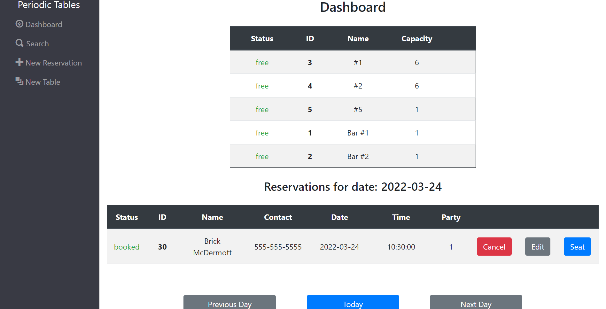

# Capstone: Restaurant Reservation System

[Live application URL](https://restaurant-client-bm.herokuapp.com/)

## Technology Used
### Frontend
* ReactJS
* CSS
* Bootstrap
* JSX
### Backend
* Postgres (knex)
* NodeJS
* Express

## Summary
Periodic Tables is a restaurant schedule management application that allows a restaurant manager to create/document tables and reservations. It provides the ability to filter reservations by phone number, sort reservations by those that are booked, seated, and completed.

Users can also create tables and assign capacity to reflect the tables in the restaurant.

## Installation Instructions
### Frontend
* ```cd``` into Thinkful/front-end
* run ```npm install```
* run ```npm start``` to start the application
### Backend
* ```cd``` into Thinkful/back-end
* run ```npm install```
* run ```npm run``` reset to rollback, migrate and seed the database
* run ```npm start``` to start the application

# Features
## Creating A Reservation
Creating a reservations is done by clicking 'New Reservation' on the navigation bar. This requires the customer's first name, last name, reservation date, reservation time, quantity of guests, and phone number.


## Managing Reservations
Managing reservations can be done via the dashboard.

The dashboard by default will list the reservations for today. Use the previous and next buttons on the top right of the reservations table to look at reservations in the past or future.

The tables and their availability are listed in the list on the on the far right of the page.



## Searching for a Specific Reservation
Users can search for a particular reservation by the mobile number associated with the reservation. This can be done by clicking the 'Search' option in the left-hand navigation.


## Managing Tables
Expanding the restaurant? Create new tables by selecting the 'New Table' option in the left-hand navigation.


# API
## Reservations by Date
**GET /reservations?date=<reservation_date>** 

Returns reservations for a particular date

**Required body:**

|    Param    |    Type    |
|-------------|------------|
| ```date```  | ```date``` |

## Reservations by Id
**GET /reservations/:reservation_id**

Returns reservation for a particular id

**Required body:**

|        Param         |     Type    |
|----------------------|-------------|
| ```reservation_id``` | ```(int)``` |

## Create Reservation
**POST /reservations**

Returns a new reservation

**Required body:**

|          Param         |     Type    |
|------------------------|-------------|
|     ```first_name```   |  ```str```  |
|     ```last_name```    |  ```str```  |
|       ```party```      |  ```int```  |
| ```reservation_date``` |  ```date``` |
| ```reservation_time``` |  ```time``` |
|   ```mobile_number```  |  ```str```  |

## Update Reservation
**PUT /reservations/:reservation_id**

Modifies an existing reservation given an existing reservation Id

**Required body:**

|          Param         |     Type    |
|------------------------|-------------|
|  ```reservation_id```  |  ```int```  |
|     ```first_name```   |  ```str```  |
|     ```last_name```    |  ```str```  |
|       ```party```      |  ```int```  |
| ```reservation_date``` |  ```date``` |
| ```reservation_time``` |  ```time``` |
|   ```mobile_number```  |  ```str```  |

## Update Reservation Status
**Put /reservations/:reservation_id/status**

Modifies an existing reservation's status

**Required body:**

|           Param          |    Type    |
|--------------------------|------------|
|   ```reservation_id```   | ```int```  |
| ```reservation_status``` | ```str```  |

## List Tables
**GET /tables**
Returns the available tables.

## Create Table
**POST /tables**

Returns a new table

**Required body:**

|       Param      |    Type    |
|------------------|------------|
| ```table_name``` | ```str```  |
|  ```capacity```  | ```int```  |

## Update Table Status
**PUT /tables/:table_id/seat**
Sets table status to 'occupied' and ties a restaurant_id to it.

**Required body:**

|         Param        |    Type    |
|----------------------|------------|
| ```reservation_id``` | ```int```  |
|    ```table_id```    | ```int```  |

## Finish Table
**DELETE /tables/:table_id/seat**

Sets the table status to free and the accompanying reservation status to finished

**Required body:**

|      Param     |    Type    |
|----------------|------------|
| ```table_id``` | ```int```  |
